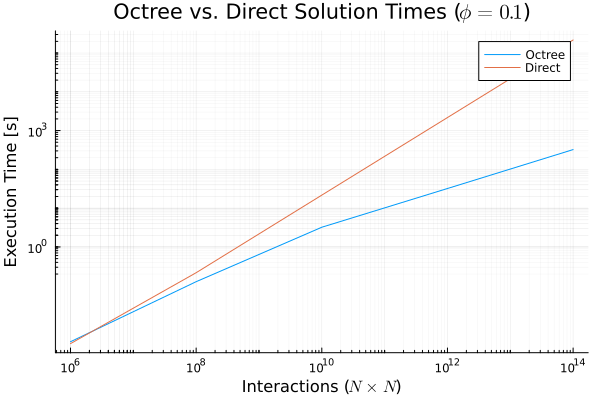

# `thor`

Approximate Biot-Savart Law integration to calculate magnetic fields in linear time using octrees and the Barnes Hut algorithm.

[Docs](docs/thor.md)  
[Tests and Benchmarks](docs/tests-and-benchmarks.md)  
*Note: sourcehut doesn't render LaTeX in markdown docs, so I'm still working on hosting them elsewhere...*  

## Background

*This is a prototype code and not meant for production applications.*  

The Biot-Savart Law is widely used to calculate the magnetic fields of electromagnets by summing the contributions of many small magnetic field sources at a large number of target points. This calculation, in its simplest form, has time complexity of `O(M x N)`, where `M` is the number of source points and `N` is the number of target points. 

This code applies the [Barnes Hut algorithm](https://en.wikipedia.org/wiki/Barnes%E2%80%93Hut_simulation) for large-N interaction problems to achieve linear time complexity of the same calculation while maintaining reasonable (<1%) error relative to the full ("direct") calculation.  

Effectively, the program uses an octree, which is a tree structure that divides the problem space recursively into 8 octants. Each octant hosts a collection of source points, which are summed together at each node. If the distance between the node and a target point is far enough away such that treating the many source points within the node as one large "super source", the node is 'accepted' and an approximate calculation is performed. If the node is too close, then it is recursively subdivided and the same acceptance criteria is applied again. 

In practice, an acceptance criteria of `phi = node_size/distance = 0.1` has been found to be effective. 

Problem sizes typically solved on a workstation laptop (i.e. finite element meshes of <10M elements) are considered for testing of this code. On the development machine (a high-end consumer-grade desktop computer with approximate value < $1500) a mesh of 1M sources and 1M target points (1e12 interactions) can be calculated in about 30 seconds, in single-threaded execution.

See [https://jheer.github.io/barnes-hut/](https://jheer.github.io/barnes-hut/) for an excellent demo of the algorithm applied to gravitational problems. 

This is *not* a fast multipole method (FMM) code. The FMM is significantly more complex to implement, likely by an order of magnitude or more. This code is designed to be simple to implement and understand while still offering excellent performance. 

## Roadmap 

### To do 
- [ ] Add multithreading capability (trivially easy to do, not the focus of this demo)
- [ ] Add tests: points in 3D space, fix the loop test, force summation on multiple electromagnets
- [ ] Reduce the size of structs to reduce memory pressure; consider a struct-of-arrays approach

### To investigate 
- [ ] Eliminate recursion by using explicit tree traversal
- [ ] Implement dual-tree traversal (this sounds difficult)
- [ ] Add multipole expansion (are we FMM yet?) to improve accuracy for larger `phi` values

### Known Bugs 
- [ ] An earlier version of this program leaked signficant amounts of memory, rendering the Julia interface unusable 
- [ ] Rellocation of the tree node array can cause crashes

## Installation
*Note: Windows is not directly supported by this program, though with some modification it should work just fine.*
1. Ensure a C99 compiler is installed on your system. `gcc` (Linux) and `clang` (MacOS) have both been tested with this software. 
2. Modify the Makefile in this root directory as needed. 
3. Ensure that your terminal's working directory is this project root directory and enter `make`. 

## How to Use
See the `tests/` folder for examples.

A Julia interface is included for convenience in scripting applications. 

## License
GPL. Closed-source forks and distributions are not permitted.

