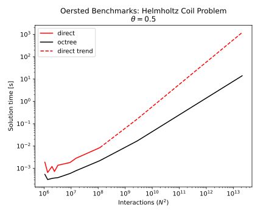
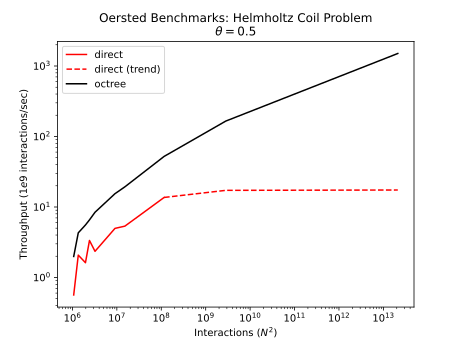
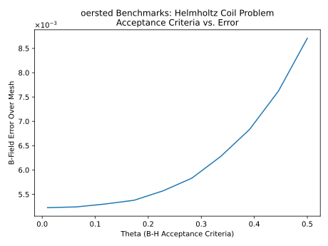

# `oersted`

Lightning-fast magnetic field calculations using octrees and the Barnes-Hut algorithm



## Installation

`oersted` can be installed via pypi:
```bash
pip install oersted
```

See [Development Notes](#development-notes) below.

### Example
```python
import oersted 

# Assume the following NumPy arrays are already defined: 
# centroids: Nx3 element centroid locations
# vol: N-length, volume of each element 
# jdensity: Nx3 elemental current-density vectors 
# targets: Nx3 target point locations in 3D space 

theta = 0.25        # B-H accuracy parameter

# Compute the magnetic flux density at each target
b = oersted.bfield_octree(
    centroids, vol, jdensity, targets, theta=theta
)
```

## Background

*This is a prototype code and not meant for production applications.*  

The Biot-Savart Law is widely used to calculate the magnetic fields of electromagnets by summing the contributions of many small magnetic field sources at a large number of target points. This calculation, in its simplest form, has time complexity of `O(M x N)`, where `M` is the number of source points and `N` is the number of target points. 

### Barnes-Hut Algorithm
This code applies the [Barnes Hut algorithm](https://en.wikipedia.org/wiki/Barnes%E2%80%93Hut_simulation) for large-N interaction problems to achieve linear time complexity of the same calculation while maintaining reasonable (<1%) error relative to the full ("direct") calculation.  

Effectively, the program uses an octree, which is a tree structure that divides the problem space recursively into 8 octants. Each octant hosts a collection of source points, which are summed together at each node. If the distance between the node and a target point is far enough away such that treating the many source points within the node as one large "super source", the node is 'accepted' and an approximate calculation is performed. If the node is too close, then it is recursively subdivided and the same acceptance criteria is applied again. In practice, an acceptance criteria of `phi = node_size/distance = 0.5` has been found to be effective for self-fields problems. 

See [https://jheer.github.io/barnes-hut/](https://jheer.github.io/barnes-hut/) for an excellent demo of the algorithm applied to gravitational problems. 

### Intended Problems

The intended problem for this code is a finite element mesh of a *solenoidal* collection of current-carrying 3D bodies. The magnetic field generated by these currents can either be computed on the bodies themselves (self-field) or at a collection of points not on the bodies. Each element is treated as a component of a finite sum approximation to the Biot Savart integral. 

Problem sizes typically solved on a workstation computer (i.e. finite element meshes of <10M elements) are considered for testing of this code. 

## Benchmarks and Error Estimation

*All benchmarks are performed on a Linux workstation with an AMD Ryzen 9 9950X (16-core consumer CPU)*

Benchmarks are performed against an optimized (SIMD-accelerated) direct summation algorithm. Error is measured relative to the direct summation algorithm. Both benchmarking and error estimation are performed using the **self-fields** Helmholtz coil problem (see `tests/test_helmholtz.py` for a full description) and computed using 6 CPU cores.

### Benchmarks

While the throughput of the direct summation algorithm is limited by memory bandwidth to roughly 15B interactions/sec, the throughput of the Barnes-Hut/octree algorithm continues to increase for large problem sizes, reaching nearly 1T effective interactions/sec for a problem size of ~2T interactions (1.4M source/target elements):   


Solution time for 1.4M source/target elements was ~2 sec, which is 40x faster than the direct summation algorithm!

### Error Estimation

The mean relative error across every element of the source/target mesh is considered for the error metrics. Even when using a rather aggressive node acceptance criteria of 0.5, the mean relative error across the mesh remains <1%:



## Description of the Algorithm
TODO.

## Development Notes

`oersted` is written in Rust, with Python bindings. It can be used either directly as a dependency to a Rust project or (most commonly) through Python scripts. The program is currently only available as source (no wheels or binaries), so the following tools are required: 

- `cargo` and `rustc`: for managing and compiling the Rust backend
- `uv`: for managing the Python project
- `maturin`: for managing the Rust/Python compiling/binding process

### Rust Dependencies 

This code was designed to use a minimum of dependencies. The basic algorithms have zero dependencies, though the following are added as optional for useful features:  

- `rayon`: for efficient multithreading
- `pyo3` and `numpy`: for generating Python bindings and efficiently passing arrays between Rust and Python

## License
MIT or Apache 2.0, at your option.
