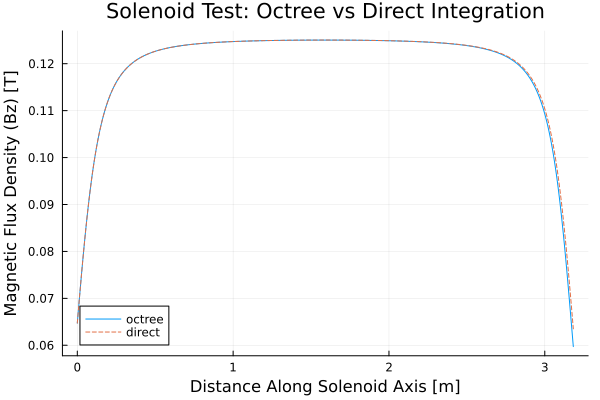

# Tests and Benchmarks 

## Validation Tests 

1. Magnetic field along the axis of a solenoid 
2. [IN PROGRESS] Magnetic field along the axis of a current-carrying loop (known analytical solution; $N \times M$ problem). Lines drawn along the axis (compare to analytical solution) and along the plane (compare to direct summation)

## Magnetic field along the axis of a solenoid 

A solenoid is a electromagnetic device where a wire is coiled in a hollow cylindrical shape many times. The field strength along the axis of the cylinder is independent of the diameter, as long as the length is much greater than the radius:  

$$ B = \mu_0 \cdot n \cdot I $$

where:
* $n$ is the number of turns per unit length ($turns/m$)
* $I$ is the electric current in each turn of the solenoid ($A/turn$)

### Parameters
Consider a solenoid discretized as a solid finite element mesh with the following properties:  
* Element size: $h=10mm$
    * Volume of each element: $h^3 = 1\cdot10^{-6}\ m$
    * Turns per length: $n = 1/h = 100\ turns/m$
* 100 elements along the circumference, such that $r = 1/2\pi\ m $
* Length of solenoid: $L>10r; L > 5/\pi\ m$
* Current: $I = 1000\ A$

Therefore, the expected magnetic field along the length of the solenoid is: 

$$ B = (4\pi\cdot10^{-7}) \cdot (100\ turns/m) \cdot (1000\ A/turn) = 0.1257\ T $$

The minimum number of source elements is: 
$$ M_{min} = L{min} \cdot 100\ elements/turn \cdot 100\ turns/m \approx 16K\ elements $$

### Results Using Octree Approach

## Magnetic field along the axis of a current-carrying loop

Given a current carrying loop of:
* Radius `R = 1.5m` 
* Total current `I = 2.5 MA` 

Compute the magnetic field along the axis of the loop from -1m to +1m.

